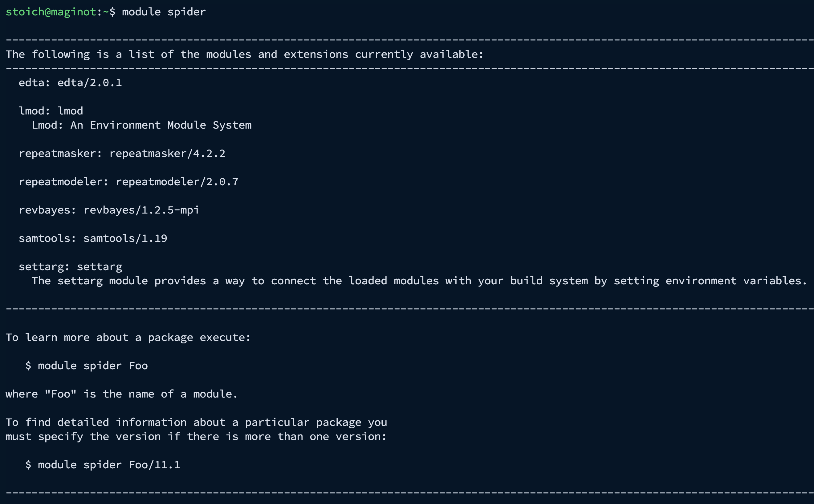
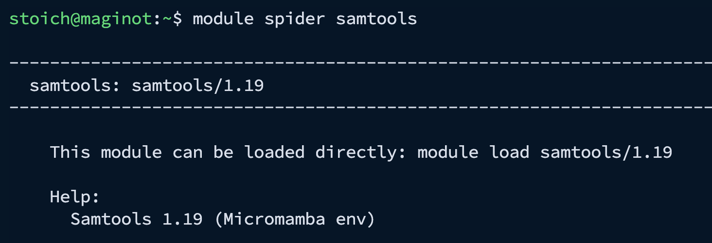
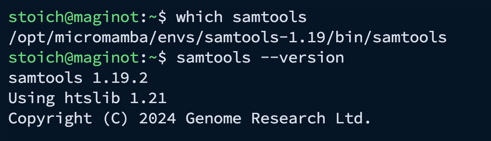
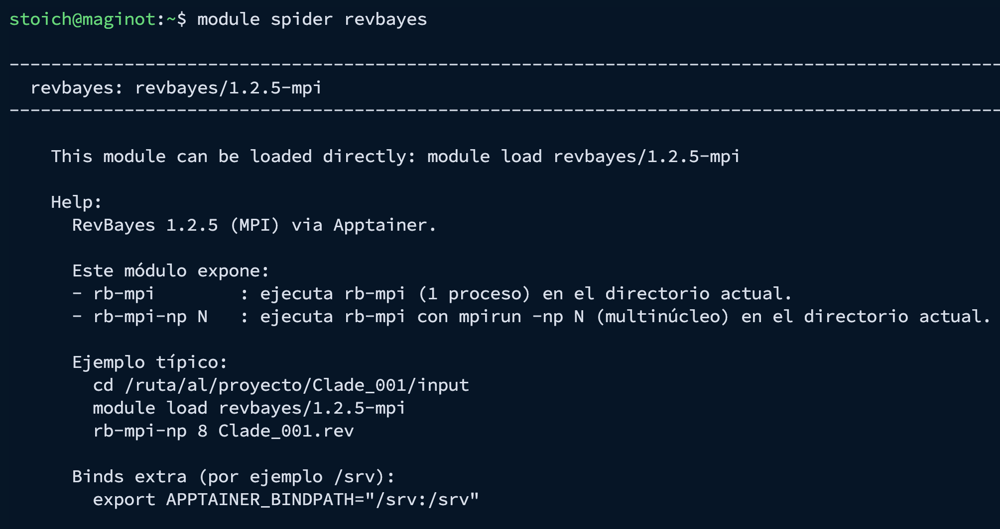
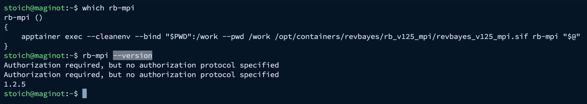

## Objetivo

En MAGINOT el software se ofrece de forma controlada para mantener un entorno \*\*estable, seguro y reproducible\*\*.

Esta sección explica cómo usar el sistema de **módulos (Lmod)** y, al final, cómo se gestionan herramientas vía **Micromamba** y **Apptainer**.

------------------------------------------------------------------------

## Si necesitas un programa nuevo (importante)

Si el software que necesitas **no está disponible** como módulo o contenedor, **no intentes instalarlo por tu cuenta**.

✅ En MAGINOT, la instalación de software que requiere permisos (y la creación/actualización de ambientes) se realiza **solo por el administrador**.

### ¿Cómo solicitar software al administrador?

Incluye en tu solicitud:

-   **Nombre del software**
-   **Versión** (si aplica)
-   **Uso** (curso/proyecto)
-   **Enlace oficial** (GitHub/docs) o referencia de instalación (conda/bioconda, contenedor, etc.)
-   Requerimientos especiales: **MPI**, **GPU**, bases de datos externas, etc.

Cuando el software esté disponible, el administrador te avisará y te indicará si se usa como:

\- **módulo**,\
- **contenedor Apptainer**,\
- o dentro de un **ambiente Micromamba**.

------------------------------------------------------------------------

## Módulos (Lmod): qué son y cómo se usan

Los **módulos** permiten activar software instalado en el servidor sin instalar nada en tu cuenta.\
Al cargar un módulo, se ajustan variables de entorno (por ejemplo `PATH`) para que el comando quede disponible.

### Ver el catálogo de módulos disponibles

``` bash
module spider
```

{fig-align="center" width="650"}

En este momento (ejemplo real en MAGINOT) aparecen módulos como:

-   `edta/2.0.1`

-   `repeatmasker/4.2.2`

-   `repeatmodeler/2.0.7`

-   `revbayes/1.2.5-mpi`

-   `samtools/1.19`

### Cargar un módulo (micromamba)

**Buscar información de un módulo**

``` bash
module spider samtools
```

{fig-align="center" width="450"}

**Cargar un módulo**

``` bash
module load samtools/1.19
```

**Verifica:**

``` bash
which samtools
samtools --version
```

{fig-align="center" width="450"}

### Cargar un módulo (apptainer)

**Buscar información de un módulo**

``` bash
module spider revbayes
```

{fig-align="center"}

El módulo **`revbayes/1.2.5-mpi`** proporciona **RevBayes 1.2.5 con soporte MPI**, ejecutándose **dentro de un contenedor Apptainer**, pero tú lo usas como un módulo normal.

Este módulo expone dos comandos principales:

-   `rb-mpi`\
    Ejecuta RevBayes (1 proceso) en el directorio actual.

-   `rb-mpi-np N`\
    Ejecuta RevBayes usando `mpirun -np N` (multinúcleo) en el directorio actual.

**Cargar un módulo**

``` bash
module load revbayes/1.2.5-mpi
```

**Verifica:**

``` bash
which rb-mpi
rb-mpi --version
```

{fig-align="center" width="650"}

Ejemplo de ejecución:

``` bash
cd /ruta/al/proyecto/Clade_001/input
module load revbayes/1.2.5-mpi
rb-mpi-np 8 Clade_001.rev
```

### Ver módulos cargados

``` bash
module list
```

### Descargar un módulo

``` bash
module unload samtools/1.19
```

### Limpiar el entorno (recomendado si cambias de proyecto)

``` bash
module purge
```

### Consejos para evitar conflictos

-   Inicia con `module purge` si vienes de otra sesión/proyecto.

-   Si algo “no corre”, revisa primero `module list` y confirma versiones.

-   Si necesitas otra versión, pide al administrador que la agregue como módulo.

------------------------------------------------------------------------

## Micromamba (ambientes administrados)

Micromamba se usa para mantener ambientes controlados y reproducibles, pero en MAGINOT:

✅ **Solo el administrador** puede:

-   crear nuevos ambientes

-   instalar/actualizar paquetes dentro de los ambientes

👥 Los usuarios **no crean** ambientes ni instalan paquetes.\
Si necesitas un programa por esta vía, **solicítalo al administrador**.\
Cuando esté disponible, se te indicará cómo usarlo.

**Ver ambientes disponibles**

``` bash
micromamba env list
```

**Activar (cargar) un ambiente**

``` bash
micromamba activate NOMBRE_DEL_AMBIENTE
```

**Verifica que el programa ya esté disponible:**

``` bash
which programa
programa --version
```

**Ver paquetes instalados en el ambiente**

``` bash
micromamba list
```

**Salir del ambiente**

``` .bash
micromamba deactivate
```

## Apptainer (contenedores)

**Apptainer** es una herramienta de contenedores diseñada para entornos Linux multiusuario (común en HPC).\
Permite ejecutar software empaquetado en una imagen (por ejemplo `.sif`) de forma **reproducible**, sin tener que instalar dependencias en tu cuenta, y sin requerir privilegios de administrador para correrlo.

En MAGINOT, Apptainer ya está instalado y puede usarse para correr herramientas bioinformáticas dentro de contenedores (propios o institucionales), siempre que tengas permisos de lectura sobre la imagen.

**Ejemplos:**

``` bash
apptainer exec imagen.sif comando --help
```

**Montar tu carpeta de trabajo dentro del contenedor:**

``` bash
apptainer exec -B "$PWD":/work --pwd /work imagen.sif comando
```

📌 Si necesitas una guía más completa sobre **Apptainer**, consulta mi tutorial:\
<https://cristoichkov.github.io/biocontainers/>
